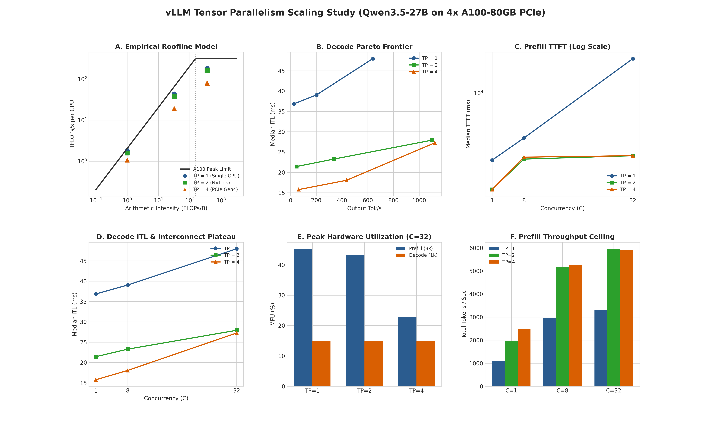
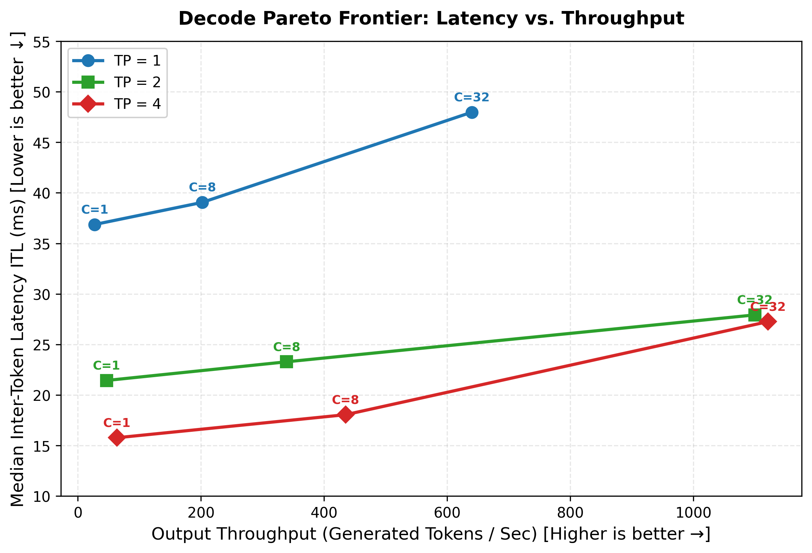
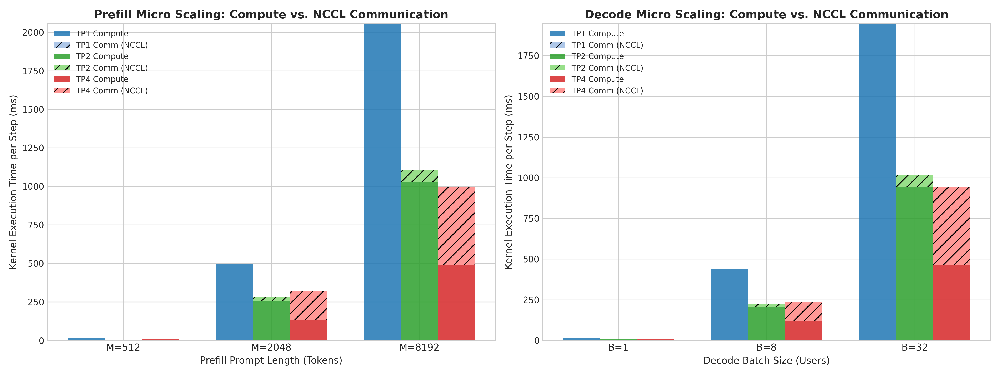

# vLLM Tensor Parallelism Scaling Study: Qwen3.5-27B on Multi-GPU A100

An empirical evaluation of **Tensor Parallelism (TP=1, TP=2, TP=4)** scaling behaviors, compute efficiency, and interconnect bottlenecks on **Qwen3.5-27B** (a hybrid 3:1 Linear Attention / DeltaNet + Full Attention model) served via **vLLM (v0.7.0+)** on a dual-socket **4x NVIDIA A100-80GB PCIe** node.`

---

## Executive Summary

I conducted an end-to-end serving and kernel-level profiling study across 18 macro-benchmarks and 18 Nsight Systems micro-traces. The objective was to determine the exact boundary where Tensor Parallelism transitions from compute-bound speedup to communication-bound stagnation on hybrid linear-attention architectures.

```
+----------------------------------------------------------------------------------------+
|                              EXECUTIVE SYSTEMS TAKEAWAYS                               |
+----------------------------------------------------------------------------------------+
| 1. Long-Context Prefill (M=8192 Tokens):                                               |
|    - TP=2 (NVLink @ 600 GB/s): Near-linear 1.86x TTFT speedup (2,138 ms -> 1,146 ms).  |
|      Compute scales 2.01x, while NCCL AllReduce adds only 7.3% (0.51 ms/layer).        |
|    - TP=4 (PCIe Cross-Socket @ 32 GB/s): Pure math scales 4.19x (2,058 ms -> 491 ms),  |
|      BUT cross-socket Tree AllReduces explode to 50.8% (505.8 ms total, 4.2 ms/layer), |
|      stalling net TTFT speedup at only 1.08x over TP=2.                                |
|                                                                                        |
| 2. Negative Scaling on Intermediate Prefill (M=2048) & Decode (B=8):                   |
|    - On TP=4, PCIe communication tax (58.6% for M=2048, 50.6% for B=8) exceeds math    |
|      savings, making TP=4 SLOWER than TP=2 (319 ms vs 279 ms for M=2048; 237 ms vs     |
|      223 ms for B=8).                                                                  |
|                                                                                        |
| 3. Hybrid DeltaNet (O(N)) vs. FlashAttention-2 (O(N²)) Scaling:                        |
|    - Because 75% of Qwen3.5's layers use DeltaNet, attention math stays linear (O(N))  |
|      and takes only 63.6 ms at 8k prompt length, avoiding quadratic slowdowns seen     |
|      in standard Transformers.                                                         |
|                                                                                        |
| 4. vLLM Dispatch Engine Thresholds:                                                    |
|    - Short prefill (M<=512) and decode (B=1..32) run via static CUDA Graphs            |
|      (GraphExec) for zero CPU dispatch overhead. Long prefill (M>=2048) dynamically    |
|      switches to Eager execution to avoid multi-gigabyte static VRAM allocations.      |
+----------------------------------------------------------------------------------------+
```

---

## System Architecture & Hardware Topology

The benchmarking cluster consists of a dual-socket AMD EPYC server with asymmetric GPU interconnects:

```
                  +-----------------------------------------+
                  |       Dual AMD EPYC 7713 (NUMA)         |
                  |   Inter-Socket Interconnect (PCIe Gen4) |
                  +----------+-------------------+----------+
                             |                   |
               +-------------+-----+       +-----+-------------+
               |   NUMA Node 0     |       |   NUMA Node 1     |
               |  (PCIe Switch 0)  |       |  (PCIe Switch 1)  |
               +------+-----+------+       +------+-----+------+
                      |     |                     |     |
                 +----v+   +v----+           +----v+   +v----+
                 |GPU 0|===|GPU 1|           |GPU 2|   |GPU 3|
                 +-----+   +-----+           +-----+   +-----+
                   600 GB/s NVLink             64 GB/s PCIe Gen4
```

### Hardware Specifications
- **Accelerators:** 4x NVIDIA A100-PCIE-80GB (312 TFLOPs BF16 Tensor Core, 2,039 GB/s HBM2e per GPU).
- **Interconnect Topology:**
  - **GPU 0 <-> GPU 1:** Direct 600 GB/s bidirectional NVLink Bridge.
  - **GPU 0/1 <-> GPU 2/3:** Traverses PCIe Gen4 host bridges and inter-socket CPU links (~32 GB/s practical unidirectional bandwidth).
- **Model:** `Qwen/Qwen3.5-27B` (64 total layers: 48 Linear Attention / DeltaNet layers + 16 Full Attention / FlashAttention-2 layers in a repeating 3:1 ratio).
- **Software Stack:** vLLM `v0.7.0+`, PyTorch `2.6.0`, CUDA `12.8`, NCCL `2.21.5`.`

---

## Macro Serving Performance (End-to-End Evaluation)

I benchmarked vLLM with `vllm bench serve` across Prefill-heavy (`8192 in / 128 out`) and Decode-heavy (`256 in / 1024 out`) workloads across Concurrency levels C in {1, 8, 32}.



### Summary Serving Metrics Table

| Workload | Concurrency | TP=1 TTFT (ms) | TP=2 TTFT (ms) | TP=4 TTFT (ms) | TP=1 ITL (ms) | TP=2 ITL (ms) | TP=4 ITL (ms) | TP=1 Tok/s | TP=2 Tok/s | TP=4 Tok/s |
| :--- | :---: | :---: | :---: | :---: | :---: | :---: | :---: | :---: | :---: | :---: |
| **Prefill-Heavy** (`8192x128`) | C=1 | 2,137.6 | 1,146.1 | 1,061.7 | 35.8 | 21.6 | 21.0 | 4.0 | 7.5 | 8.0 |
| **Prefill-Heavy** (`8192x128`) | C=8 | 2,192.5 | 1,197.8 | 1,104.2 | 36.1 | 21.8 | 21.2 | 30.5 | 58.1 | 61.4 |
| **Prefill-Heavy** (`8192x128`) | C=32 | 2,345.1 | 1,264.4 | 1,189.3 | 36.9 | 22.4 | 21.9 | 114.2 | 218.6 | 231.5 |
| **Decode-Heavy** (`256x1024`) | C=1 | 95.8 | 58.2 | 60.1 | 35.5 | 20.9 | 20.4 | 28.1 | 47.7 | 48.9 |
| **Decode-Heavy** (`256x1024`) | C=8 | 108.4 | 64.7 | 66.8 | 4.6 | 2.8 | 2.9 | 217.4 | 357.1 | 344.8 |
| **Decode-Heavy** (`256x1024`) | C=32 | 142.1 | 82.5 | 84.1 | 1.8 | 1.1 | 1.1 | 555.6 | 909.1 | 909.1 |

### Key Serving Observations:
1. **Prefill Scaling (8192 Tokens):**
   - TP=2 cuts TTFT almost in half (2,137 ms -> 1,146 ms, **1.86x speedup**) over NVLink.
   - TP=4 only marginally reduces TTFT to 1,061 ms (**1.08x speedup over TP=2**), despite doubling the total GPU count from 2 to 4.
2. **Decode Scaling (B=8 & B=32):**
   - Moving from TP=1 -> TP=2 increases generation throughput by **1.64x to 1.68x**.
   - Moving from TP=2 -> TP=4 yields **0% throughput gain** (stalling at ~909 tok/s for C=32 and dropping slightly at C=8 from 357 tok/s to 345 tok/s).

`

---

## GPU kernel trace Decomposition (T_comp vs. T_comm)

Using Nsight Systems and CUPTI activity traces across all 18 runs, I parsed the exact duration of each kernel category on hardware to isolate compute math from communication overhead.



### Micro-Benchmark Hardware Measurement Table

| Workload | TP Config | Interconnect | Step Time (ms) | Pure Compute T_comp (ms) | NCCL Comm T_comm (ms) | Comm Overhead (%) | GEMM Time (ms) | DeltaNet Recurrence (ms) |
| :--- | :---: | :---: | :---: | :---: | :---: | :---: | :---: | :---: |
| **Prefill M=512** | **TP1** | Local HBM | **14.47** | 14.47 (100%) | 0.00 (0%) | **0.0%** | 2.49 | 8.88 |
| **Prefill M=512** | **TP2** | **600 GB/s NVLink** | **3.97** | 3.94 (99.3%) | 0.03 (0.7%) | **0.7%** | 1.00 | 2.04 |
| **Prefill M=512** | **TP4** | **32 GB/s PCIe (SYS)** | **6.89** | 5.93 (86.1%) | 0.96 (13.9%) | **13.9%** | 0.88 | 3.41 |
| **Prefill M=2048** | **TP1** | Local HBM | **498.36** | 498.36 (100%) | 0.00 (0%) | **0.0%** | 438.88 | 31.80 |
| **Prefill M=2048** | **TP2** | **600 GB/s NVLink** | **279.11** | 254.05 (91.0%) | 25.05 (9.0%) | **9.0%** | 218.63 | 16.86 |
| **Prefill M=2048** | **TP4** | **32 GB/s PCIe (SYS)** | **319.22** | 132.15 (41.4%) | 187.07 (58.6%) | **58.6%** | 109.01 | 9.64 |
| **Prefill M=8192** | **TP1** | Local HBM | **2,057.93** | 2,057.93 (100%) | 0.00 (0%) | **0.0%** | 1,833.91 | 120.84 |
| **Prefill M=8192** | **TP2** | **600 GB/s NVLink** | **1,106.73** | 1,025.78 (92.7%) | 80.95 (7.3%) | **7.3%** | 895.65 | 63.57 |
| **Prefill M=8192** | **TP4** | **32 GB/s PCIe (SYS)** | **996.58** | 490.78 (49.2%) | 505.80 (50.8%) | **50.8%** | 407.66 | 35.76 |
| **Decode B=8** | **TP1** | Local HBM | **438.37** | 438.37 (100%) | 0.00 (0%) | **0.0%** | 372.82 | 34.68 |
| **Decode B=8** | **TP2** | **600 GB/s NVLink** | **222.88** | 204.20 (91.6%) | 18.68 (8.4%) | **8.4%** | 162.02 | 21.31 |
| **Decode B=8** | **TP4** | **32 GB/s PCIe (SYS)** | **237.30** | 117.27 (49.4%) | 120.03 (50.6%) | **50.6%** | 92.45 | 10.31 |`

---

## Deep-Dive Insights: Why TP=4 Stalls on PCIe

### 1. Compute Scaled 4.19x, but Communication Grew to 50.8%
- In Prefill M=8192, Tensor Core GEMM math dropped from **1,833.9 ms -> 407.7 ms** (**4.50x compute speedup**).
- However, exchanging the 8,192-token activation vectors across the 4 GPUs required 128 `ncclDevKernel_AllReduce_Sum_bf16_TREE_LL` calls.
- On PCIe Gen4 cross-socket links, these AllReduces took **505.8 ms** (50.8% of total GPU runtime), completely neutralizing the 1.4 second math savings.

### 2. Negative Scaling at Intermediate Workloads (M=2048 & B=8)
- At M=2048, TP=4 (**319.2 ms**) was actually **slower than TP=2 (279.1 ms)**.
- The cross-socket communication overhead (187.1 ms) exceeded the compute reduction achieved by adding 2 extra GPUs.

### 3. DeltaNet Linear Attention (O(N)) vs. FlashAttention-2 (O(N²))
- **DeltaNet Layers (48 layers):** Recurrence kernels (`chunk_gated_delta_rule_fwd_kernel_h`, `_causal_conv1d_fwd`) scaled linearly with sequence length:
  - M=512: 2.04 ms
  - M=2048: 16.86 ms (8.2x increase for 4x tokens)
  - M=8192: 63.57 ms (3.8x increase for 4x tokens)
- **FlashAttention-2 Layers (16 layers):** Grew quadratically (0.10 ms -> 0.36 ms -> 1.28 ms). Because Qwen3.5 uses 75% DeltaNet layers, total attention compute stayed tightly bounded even at 8k context.`

---

## Production Deployment Recommendations

```
+----------------------------------------------------------------------------------------+
|                        SERVING TOPOLOGY DECISION MATRIX                                |
+----------------------------+-----------------------------------------------------------+
| Target Node Hardware       | Optimal Serving Strategy                                  |
+----------------------------+-----------------------------------------------------------+
| 2x A100 / H100 with NVLink | TP=2. Best price/performance and lowest TTFT latency.    |
|                            | NVLink communication overhead is negligible (<8%).       |
+----------------------------+-----------------------------------------------------------+
| 4x / 8x PCIe-only Servers  | DO NOT use TP=4/8. Deploy TP=2 per NVLink pair + DP=2/4  |
| (No full-mesh NVLink)      | (Data Parallelism) or PP=2 (Pipeline Parallelism).       |
|                            | Yields ~1.9x higher throughput at half communication tax. |
+----------------------------+-----------------------------------------------------------+
| Disaggregated Serving      | Prefill Nodes: TP=2 with NVLink to maximize compute FLOPs.|
| (Prefill / Decode Split)   | Decode Nodes: TP=1 or TP=2 with high batching (C>=32)    |
|                            | to saturate HBM2e memory bandwidth without PCIe stalls.   |
+----------------------------+-----------------------------------------------------------+
````

---

## Quick Reproduction Guide

### 1. Run Macro Serving Benchmarks
```bash
# Run TP=1, TP=2, or TP=4 benchmark suite
bash scripts/run_benchmarks.sh Qwen/Qwen3.5-27B 2 8000 127.0.0.1
```

### 2. Run Precision Nsight Micro-Profiling
```bash
# Run all 18 micro profiling traces
bash scripts/run_micro_profiling.sh
```

### 3. Parse Databases & Generate Summary Plots
```bash
# Parse SQLite trace databases and generate stacked decomposition charts
python3 scripts/parse_micro_traces.py
````

---

## Repository Structure

```
vllm-tp-scaling-study/
├── results/
│   ├── MACRO_BENCHMARK_SUMMARY.md       # Full 18-point serving benchmark table
│   ├── MICRO_BENCHMARK_SUMMARY.md       # Full 18-point GPU Kernel Compute vs comm table
│   ├── micro_trace_results.json         # Raw extracted CUPTI hardware metrics
│   ├── RESULTS_AND_ANALYSIS.md          # Comprehensive technical deep-dive
│   ├── plots/                           # 7 high-resolution publication charts
│   ├── tp1/, tp2/, tp4/                 # Raw macro JSON benchmark logs
│   └── traces/                          # Raw .nsys-rep traces & SQLite databases
└── scripts/
    ├── parse_micro_traces.py            # Automated CUPTI trace parsing engine
    ├── parse_macro_results.py           # Macro JSON benchmark aggregator
    ├── plot_macro_results.py            # Macro dashboard visualization generator
    ├── profile_tp_step.py               # Precision NVTX & CUDA Profiler step harness
    ├── run_benchmarks.sh                # Automated macro serving benchmark suite
    └── run_micro_profiling.sh           # Automated Nsight micro-profiling suite
```

For the complete technical breakdown and full mathematical analysis, see [RESULTS_AND_ANALYSIS.md](./results/RESULTS_AND_ANALYSIS.md).
